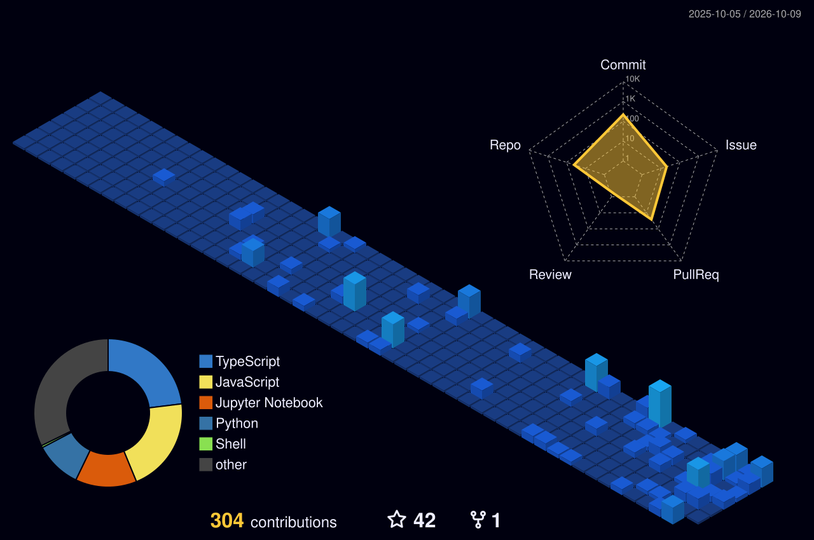

# 👋 Hi, I'm Rushi!

🎓 Computer Science student specializing in Artificial Intelligence at VIT Pune

🤖 Interested in Artificial Intelligence, Machine Learning and Generative AI

💻 I enjoy building projects, participating in hackathons and exploring new technologies

🌱 Currently learning DSA, Generative AI, MLOps and Full-Stack Development

🤝 Looking to collaborate on AI/ML, Open Source and interesting tech projects

⚡ Fun fact: I love turning random ideas into working projects

## 🛠️ Tech Stack

### 👨‍💻 Languages

  

### ⚙️ Technologies

  

### 🤖 AI / Machine Learning

  

### 📚 Libraries & Tools

  

## 🔗 My Profiles

## 📫 Contact Me

For collaboration, project work or interesting technical discussions, feel free to reach out.

📧 **Email:** [Contact Me](mailto:YOUR_EMAIL)

## 📈 GitHub Stats

## 💻 Most Used Languages

## 🏆 What I'm Working On

- Artificial Intelligence and Machine Learning projects
- Generative AI applications
- Full-Stack applications
- Hackathons and technical competitions
- Open Source projects
- DSA and problem solving

## 📊 My Contributions

## 🚀 Current Focus

`AI/ML` • `Generative AI` • `DSA` • `MLOps` • `Full-Stack Development`

---

  <b>Keep Learning • Keep Building • Keep Exploring</b>

